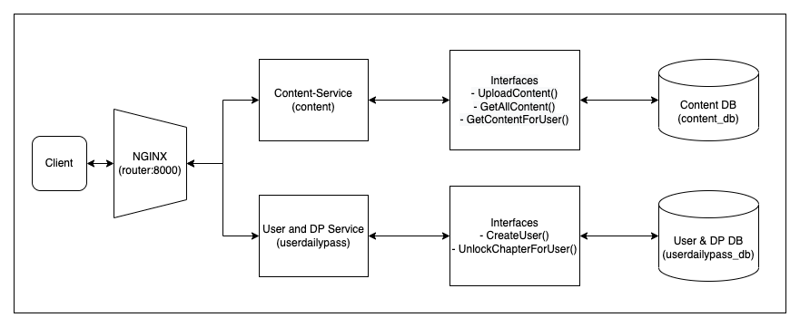

# Pratilipi
## _Microservice Backend Assignmnet_

This repository contains the solution in response to the assignment given by _Pratilipi_.
We need a system with eventually three microservices(two of them are merged for now as asked in the assignment 
document). The microservices are as follows:

1. Content-Service: This service is supposed to provide the support to store/retrieve and manage 
the content 
  (series, chapters, metadata) to external clients or other services. The APIs offered by this service are 
  as following:
   - Upload content (series + chapters): [POST] `/api/v1/content/`
   ```json
      {
         "title": string,
         "chapters" : [{"title": string}, {"title": string}]
      }
    ```
   - Fetch all content: [GET] `/api/v1/content/`
   
   - Fetch all content for a user: [GET] `/api/v1/content/`
   ```shell

      Query params:
        user_id: string
    ```


2. User and Daily Pass Service (Referred as User and DP Service): This service is the merge of 
  two supposed services(user management service and daily pass service). This service is 
  responsible to manage user-data and chapter unlocking by users. The APIs 
  offered by this service are as following:
     - Create user : [POST] `/api/v1/user/`
   ```json
      {
         "username": string,
         "password" : string
      }
    ```
   
   - Unlock chapter for user: [POST] `/api/v1/daily_pass/` 
   ```shell

      Query params:
        user_id: string

    ```

    ```shell
      Body:
         {
            "title": string
         }
    ```

These services are not directly exposed to the external world, but they can be accessed via a router
(Nginx in this case).

## High Level Design
The high-level architecture have 5 components.
1. NGINX: This is a container running a **Nginx** image which is configured to redirect the 
   traffic based upon path. All the  traffic coming from the external world goes through port 
   `8000` of the `router` container. The nginx configuration and Dockerfile can be found 
   in `./nginx` directory.
2. Content-Service: Running on port `8000` of the `content` container. The related code to this 
   service can be found in `./content_service` directory.
3. User and DP Service: Running on port `8000` of the `userdailypass` container. The related code 
   to this service can be found in `./user_and_dp_service` directory
4. Content DB: Running on port `3306` of the `content_db` container.
5. User & DP DB: Running on port `3306` of the `userdailypass_db` container.



## Software Requirement
You will need [Docker] and [Docker Compose] on the host in order to start the application.

## How to use

- Clone the repository:
```shell
git clone https://github.com/SanjanaKansal/pratilipi_assignment
```
- Start the containers:
```shell
docker-compose -f docker-compose.yml up -d --remove-orphans
```

This will start the complete application and expose a service on port `8000` of the host. A 
postman collection is attached to give an example of all the APIs in `pratilipi.postman_collection.json` file. 

## Further Improvements
1. Intercommunication between the services is happening through REST API calls which can be changed 
to RPC calls.
2. All APIs can have all sort of request and data validation, e.g.: type validation, password 
strength check etc.

## Tech

- [Python] - Python is a high-level, general-purpose programming language
- [Django] - Django is a Python-based free and open-source web framework
- [MySQL] - MySQL is an open-source relational database management system
- [Docker] - Docker is a set of platform as a service products that use OS-level virtualization to deliver software in packages called containers
- [Docker Compose] - Compose is a tool for defining and running multi-container Docker applications
- [Nginx] - Web Server

   [Python]: <https://www.python.org/>
   [Django]: <https://www.djangoproject.com/>
   [MySQL]: <https://www.mysql.com/>
   [Docker]: <https://www.docker.com/>
   [Docker Compose]: <https://docs.docker.com/compose/>
   [Nginx]: <https://www.nginx.com/>
  